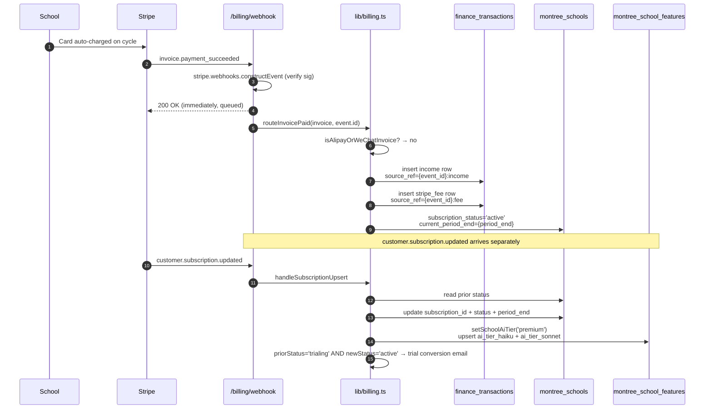

# Finance + Billing System — Deep Triple Audit

**Date:** 2026-05-16
**Scope:** 3 inbound rails (stripe_subscription / alipay_invoice / manual_invoice) + outbound payouts (Stripe Connect + manual wire) + period locks + Xero scaffold + reconciliation
**Methodology:** Same as `docs/PHOTO_PIPELINE_AUDIT.md` and `docs/TRACY_MIRA_AUDIT.md` — read every file end-to-end, trace money paths, look for correctness/idempotency/auth/period-lock holes, write findings with file:line, repro, severity, fix sketch. Read-only investigation. No code changed.

---

## Executive summary

The architecture is genuinely well thought through: idempotency keys on Stripe transfers, `(source, source_ref)` UNIQUE on the ledger, race-safe customer/subscription creation, fire-and-forget webhook with 200-on-error to avoid retry storms, period-lock guard on the wire mutation surfaces, and clear separation of immutable history rows from mutable manual entries. Three audit passes (cross-file consistency / scenario walks / fresh-eye re-read) confirmed those load-bearing invariants are intact.

But the reconciliation report — the one place that's supposed to *catch* drift — has a schema mismatch that makes it silently wrong, the period-lock guard isn't applied to four of the seven write paths into the ledger (webhook + aggregator + cron + recurring), and several routes assume `usd_amount = amount_paid` even when Stripe is paid in a non-USD currency (Alipay/WeChat invoices created in USD but settled via local-currency conversion at the wallet).

**Top 3 findings, severity-ordered:**

1. **CRITICAL — Reconciliation queries non-existent columns.** `/api/montree/super-admin/finance/reconciliation/route.ts` SELECTs `amount_paid_cents` and filters on `paid_at` against `montree_billing_history`, which schema has `amount_cents` and `created_at`. The Supabase client returns `data=[]` instead of erroring — so the reconciliation report silently shows `billing_history_cross_check.paid_total_usd = $0`, then flags every period with a finding that "Stripe-side ledger and billing history disagree." Operator interprets correctly-recorded webhook payments as broken. The diff report does the opposite of its job.
2. **HIGH — Period lock guard missing on 4 of 7 ledger write paths.** `assertPeriodOpen` is applied to Stripe-Connect wire-out, manual-wire-out, and incoming-wire only. Stripe webhooks, the API usage aggregator, recurring op-expense cron, and the ledger POST/DELETE all write/mutate finance_transactions in any month without consulting `montree_period_locks`. A closed-and-audited period can be silently mutated by a late webhook arrival or a cron retry, breaking the audit trail guarantee.
3. **HIGH — FX assumption silently corrupts non-USD income.** `handleInvoicePaid` and `handleAlipayInvoicePaid` both set `usd_amount = amountPaidCents/100` and `original_currency = invoice.currency.toUpperCase()`. If Stripe ever issues an invoice in a non-USD currency (Alipay rolled out CNY/HKD/EUR support; manual rate override; future expansion), the ledger says "I received €100 = $100" even though the bank received less. Reconciliation can't catch this because of finding #1.

The system is otherwise sound. Most of the load-bearing details (Stripe idempotency keys, race-safe customer create, agent share math, paid-row immutability, immutable annual 12-row split with remainder absorption in month 1, AI tier auto-flip on subscription state changes) are all correct.

---

## Architecture as built

### Three inbound rails (schools → Montree)

1. **`stripe_subscription`** (default rail). $7/student/month, monthly recurring, quantity-based. School signs up via `/api/montree/billing/checkout` → Stripe Checkout → `customer.subscription.created` webhook flips school to `active` AND `setSchoolAiTier('premium')`. `invoice.paid` webhook writes income + Stripe fee rows to `montree_finance_transactions`.
2. **`alipay_invoice`** (China rail). Stripe Invoice with `payment_method_types: ['alipay', 'wechat_pay']` and `collection_method: 'send_invoice'`. Daily cron at 06:00 UTC reads schools with `next_invoice_due_at <= NOW() + 7 days`, calls `createAlipayInvoice()` → email school hosted-invoice URL with QR codes. School pays → `invoice.payment_succeeded` webhook → 1 income row (monthly) or 12 income rows (annual) + 1 Stripe fee row + flip status active + bump period_end.
3. **`manual_invoice`** (restricted-countries rail). Super-admin clicks "Issue manual invoice" → printable HTML invoice with Montree HK bank details + canonical reference `MONTREE-{schoolId8}-{YYYYMM}`. School wires via SWIFT → bank email confirms → super-admin clicks ⚡ Record incoming wire → income row(s) written with `source='manual_entry', source_ref='inbound_wire:{ref}'`. Annual = 12 monthly rows via `source_ref='inbound_wire:{ref}:annual:{i}'`.

### Outbound payouts (Montree → agents)

- **Stripe Connect Express** for verified agents. Super-admin clicks ⚡ Wire on a payout row → `stripe.transfers.create({ idempotencyKey: 'montree_payout_{id}_{amountCents}' })` → row flips paid + writes `commission` row to ledger.
- **Manual wire** (`payout_method='manual_wire'`) for agents in Stripe-Connect-unsupported countries. Super-admin wires via Wise/Wallex externally → records the result via ⚡ Record manual wire form → same outcome (row marked paid + commission ledger row).

### Period locks

`montree_period_locks` PK is `period_month` (YYYY-MM). `closed_at IS NOT NULL` = closed. `assertPeriodOpen(supabase, periodMonth)` returns 409 NextResponse to block mutations OR null if open. Migration-not-run handled (42P01 → fail-open).

### Xero sync (one-way mirror)

`scripts/sync-to-xero.mjs` reads unsynced finance_tx rows, maps each via `mapFinanceTxToXero()` to one of {Invoice / Bill / BankTransaction / ManualJournal / CreditNote}, writes a `montree_xero_sync_log` row. UNIQUE partial index on `(finance_tx_id, xero_object_type) WHERE status='success'` keeps it idempotent. **In scaffold mode**: it logs the intended payload but DOES NOT actually POST to Xero — every row is written as `status='skipped'` with the same `error` field. Flip to live mode by adding the real API call.

### Canonical flow — monthly Stripe subscription

---

## Findings — by category

### Correctness — money math

#### CRITICAL F-C-1 — Reconciliation queries non-existent `amount_paid_cents` + `paid_at` on `montree_billing_history`

- **Where:** `app/api/montree/super-admin/finance/reconciliation/route.ts:33-34, 117-119, 123-124`
- **What:** Code reads `b.amount_paid_cents` and filters by `paid_at`. Schema (`migrations/189_billing_phase4.sql` line 135) defines `amount_cents INTEGER NOT NULL` and only has `created_at`. Supabase silently returns rows with these fields as `undefined`, the `.filter` returns nothing, `billingPaidUsd=0`, and `stripeVsBillingDiff = grossFromStripe` is essentially the full month's revenue.
- **Why it matters:** The reconciliation report is the only programmatic safety net catching missed/duplicate webhook events. As-is it ALWAYS reports "Stripe-side ledger ($X) and billing history ($0) disagree by $X" for every period that has any revenue. Operator either ignores reconciliation (bad) or starts hunting nonexistent missed webhooks (worse).
- **Repro:** `curl '/api/montree/super-admin/finance/reconciliation?period_month=2026-05'` → `billing_history_cross_check.paid_total_usd: 0` + finding "Stripe-side ledger and billing history disagree".
- **Fix:** Replace `amount_paid_cents` → `amount_cents` in SELECT, type interface, filter, and reducer. Replace `paid_at` → `created_at` (or add a real `paid_at` column to `montree_billing_history` if you want issued-vs-paid distinction; currently the table only stamps when the row was inserted = paid event time for `paid` status).

#### HIGH F-C-2 — FX rate not captured for non-USD Stripe payments

- **Where:** `lib/montree/billing.ts:765-767` (handleInvoicePaid) and `1547-1554` (handleAlipayInvoicePaid)
- **What:** Both handlers set `usd_amount: amountPaidCents / 100` and `original_currency: invoice.currency.toUpperCase()` while leaving `fx_rate: 1.0`. The code comment at line 766 admits this: `"// assume USD; FX handled at reconciliation"`. Reconciliation route can't catch it (see F-C-1).
- **Why it matters:** Stripe Alipay/WeChat invoices can be denominated in CNY/HKD. If `payment_settings.currency` is anything but USD, `amountPaidCents` is in CNY/HKD cents and the ledger says "I received 700 USD" when actually 700 CNY ≈ 96 USD. Operator's P&L is wildly wrong. Bank reconciliation would have to be manual.
- **Repro:** Issue an alipay invoice with `currency: 'cny'` and `amount: 7000`. After payment, `montree_finance_transactions.usd_amount = 70.00` but the actual USD value is ~$10. The recorded source/source_ref aren't enough to retroactively correct.
- **Fix:** When `invoice.currency !== 'usd'`, look up the Stripe-applied exchange rate (Stripe stamps `amount_paid` in the invoice currency but also publishes `lines.data[*].amount_excluding_tax` and the `charge.balance_transaction` carries the USD-settled amount with FX rate). Persist `original_amount = amount_paid/100`, `fx_rate = balance_tx.exchange_rate || 1.0`, `usd_amount = balance_tx.amount/100`. For now (English-only / USD pricing), this is dormant — but the alipay rail comment at line 1547 also blindly converts CNY-cents-to-USD via `amount_paid / 100`, so the moment alipay is denominated in CNY the bug fires.

#### HIGH F-C-3 — `currentPeriodStart` discarded, billing_history.period_start derived from `invoice.lines.data[0].period.start` but never used to gate period assignment

- **Where:** `lib/montree/billing.ts:752-757, 800-801` (handleInvoicePaid) and `lib/montree/billing.ts:973, 1020` (handleSubscriptionUpsert)
- **What:** `handleSubscriptionUpsert` computes `currentPeriodStart` but immediately does `void currentPeriodStart;` (line 1020). The income row's `occurred_at` uses `invoice.status_transitions.paid_at` (the timestamp the invoice was *paid*), but for finance_transactions the canonical "period_month" should be derived from `invoice.period_end` (which billing-month is this revenue *for*?), not when the card cleared.
- **Why it matters:** When an invoice is finalised on 28 May but paid via 3DS challenge on 2 June (rare but happens), the income row lands in June even though it's billing-period May. Annual prepayments don't have this issue (writeAnnualIncomeRows assigns periods sequentially), but monthly does. Reports per period_month get slightly off.
- **Repro:** Stripe test: create invoice with period_end=May 31, mark paid on June 2 → finance_tx.occurred_at = June 2 → if you query reports by period_month='2026-05' you miss this row.
- **Fix:** Use `invoice.period_end` (or `lines.data[0].period.end`) as `occurred_at` instead of `status_transitions.paid_at` for the canonical "what month did we earn this for" semantics. Keep paid_at on `billing_history` for cash-basis reporting. **Or** add an explicit `period_month` column to finance_transactions and stop deriving it from `occurred_at` (currently it's computed via `periodMonthOfDate` in `writeAnnualIncomeRows` but not stamped as a column).

#### MED F-C-4 — Annual 12-row split puts remainder in month 1, not last

- **Where:** `lib/montree/billing.ts:1453-1469` and `app/api/montree/super-admin/schools/[id]/record-incoming-wire/route.ts:165-198`
- **What:** Both annual paths compute `perMonth = floor(total/12)` and put `(total - perMonth*12)` into month index 0. Sums to exactly `total`, math checks out. **But the two paths use different rounding**: webhook uses `Math.floor` on cents, manual-wire uses `Number((usdAmount/12).toFixed(2))` on dollars. For $1,512 these agree at $126/month with $0 remainder. For unusual amounts (e.g. early-adopter discount yielding $1500 annual = $125/month) they may disagree by a cent on a month.
- **Why it matters:** Two rails diverge on rounding. Not a correctness disaster — both sum to the right total — but accountant exports might show $126.00/month for one school and $125.99 + $126.13 + $126.00... for another.
- **Repro:** Run an annual prepayment of $1,499 USD on each rail. Webhook path: month 0 = $1499 - 124*12 = $1499 - 1488 = $11 + $124 = $135, months 1-11 = $124. Manual-wire path: month 0 = $124.92 + $0.08 = $125.00, months 1-11 = $124.92. Different shape.
- **Fix:** Pick one canonical algorithm (the webhook's cents-based floor-with-month-0-remainder is more precise) and copy it into the manual-wire route. Or split via banker's-round-to-cents.

#### MED F-C-5 — Stripe fee estimated, not read from Stripe

- **Where:** `lib/montree/billing.ts:748-750, 1519-1521`
- **What:** `stripeFeeEstimateCents = round(amount * 0.029) + 30`. Comment acknowledges this is an estimate — "reconcile against Stripe payouts report monthly". Real fee depends on card country (international cards = 4.4%), payment method (Alipay = 3.4% no fixed fee in China), volume tier, etc.
- **Why it matters:** P&L margin estimate drifts from reality. With reconciliation broken (F-C-1), this drift compounds invisibly.
- **Fix:** Fetch the actual `charge.balance_transaction.fee` after `invoice.paid` (one extra Stripe API call), or wait for the monthly Stripe payout report and run a reconciliation job. Cheaper option: add a small note column or update later via aggregator.

---

### Idempotency — webhook + cron rerun safety

#### LOW F-I-1 — Webhook DLQ failure path uses arrow-function `.then()` chain on supabase upsert

The webhook handler at `app/api/montree/billing/webhook/route.ts:152-163` wraps captureToDeadLetter in a try/catch correctly. **Verified clean** — even when DLQ insert fails, it logs but doesn't re-throw (would compound the original error). Architectural rule preserved.

#### Verified clean — Race-safe customer create

`getOrCreateStripeCustomer` at `lib/montree/billing.ts:351-372` uses conditional UPDATE WHERE `stripe_customer_id IS NULL` then re-fetches on no-update. Two simultaneous checkouts → second loses race, orphan customer is logged. Correct pattern.

#### Verified clean — Race-safe payout calc

`calculator.ts:367-400` uses INSERT, catches 23505 unique_violation, re-reads + checks paid/override locks, then UPDATEs. Concurrent "Calculate now" clicks don't double-write.

#### Verified clean — `insertFinanceTx` swallows 23505 silently

`billing.ts:704-708` — replays via same event_id produce silent no-op. Good. Backed by `idx_finance_tx_source_unique` partial index from migration 189 line 107.

#### Verified clean — Stripe transfer idempotency key

`payouts/[payoutId]/wire/route.ts:158` — `idempotencyKey = 'montree_payout_{id}_{amountCents}'`. Stripe dedupes for 24h. Double-click protected. Override-amount change → different key → new transfer correctly. Comment explicitly flags this as load-bearing. Don't touch.

#### MED F-I-2 — `cron/generate-alipay-invoices` re-runs in 7-day window can double-issue

- **Where:** `app/api/montree/cron/generate-alipay-invoices/route.ts:82` + `lib/montree/billing.ts:1308-1317`
- **What:** Cron filter is `next_invoice_due_at IS NULL OR <= NOW() + 7 days`. After `createAlipayInvoice()` runs, it bumps `next_invoice_due_at = now + 30/365 days`. So a second run within minutes will skip (the row's window is now ~30 days out). **But** if `next_invoice_due_at` update fails (race, transient DB error, network blip after Stripe finalized the invoice), or if the Stripe call succeeds but the post-Stripe `montree_schools.update` errors, the next cron run will re-finalise a fresh invoice for the same period. There's no source_ref-style idempotency at the invoice creation layer.
- **Why it matters:** Double-issued invoices to the school. Treasurer sees two QR codes. Possibly double-pays. Stripe handles dedup on `invoice.payment_succeeded` for the *paid* row via event_id, but two invoices means two distinct stripe_invoice_ids — both could in theory be paid.
- **Repro:** Manually clear `next_invoice_due_at` on a school after a successful invoice issuance + within 7 days. Trigger cron. Second invoice created.
- **Fix:** Either (a) make the post-Stripe `update next_invoice_due_at` atomic with the Stripe call (e.g. set the timestamp BEFORE calling `stripe.invoices.create` based on `now()` and only roll back on failure), or (b) check `montree_billing_history` for an `open` row with `status='open' AND period_month=<this period>` before calling Stripe.

#### MED F-I-3 — `record-incoming-wire` annual path has no rollback on partial failure

- **Where:** `app/api/montree/super-admin/schools/[id]/record-incoming-wire/route.ts:169-198`
- **What:** Loop writes 12 rows. If row 5 fails (DB hiccup) the code does `console.error` + `continue`. Partial roll-up state — month 0, 1, 2, 3, 4 written, 5 missing, 6-11 continue. Returns success-ish with `recognition_rows: 11`. Re-running with the same wire_ref hits the source_ref idempotency check at line 140-146 → returns `duplicate: true` for the WHOLE wire even though only 11/12 rows exist.
- **Why it matters:** Real-money annual prepayments left partially recorded. Period totals are off by 1/12 of the year. Idempotency check is too coarse-grained (per-wire, not per-row).
- **Fix:** Change the dup check to detect annual partial state (e.g. count source_refs matching `inbound_wire:{wire_ref}%` — if < 12, allow re-fill of missing months). Or wrap the 12 inserts in a Postgres transaction (Supabase doesn't support multi-statement transactions directly, would need an RPC).

---

### Period lock enforcement

#### HIGH F-P-1 — `assertPeriodOpen` missing on 4 of 7 ledger write paths

- **Where:** Multiple routes; comparison via grep
- **What:** Only 3 routes call `assertPeriodOpen`: outbound Stripe-Connect wire, outbound manual-wire, inbound manual-wire. The other 4 ledger-writing paths skip it entirely:
  1. **`/api/montree/billing/webhook`** → `handleInvoicePaid` / `handleAlipayInvoicePaid` / `handleChargeRefunded` all write `montree_finance_transactions` with no period check. A May invoice paid on May 31 via 3DS retry that finally clears June 1 lands in finance_tx with `occurred_at = June 1`. If May was closed on June 5 and the late-clearing 3DS attempt finally settles on June 6, it modifies… June (not May). But: if Stripe ever back-dates an invoice or you re-process an event after closing the period, mutation slips through.
  2. **`/api/montree/super-admin/payouts/calculate`** → calculator.ts UPDATES existing payout rows without checking if the period is closed. Closed-period agent payouts could be silently recalculated.
  3. **`/api/montree/super-admin/finance/recurring/run`** → cron writes op_expense rows on day_of_month. If the month is closed (rare but possible — e.g. close 2026-05 on June 30 after a delayed Stripe payout reconciliation, then recurring cron retroactively fires for day 31), the writes go through.
  4. **`/api/montree/super-admin/finance/ledger`** POST (manual op_expense / fx_adjustment entry) AND DELETE — no period lock check. Super-admin can manually add or delete a row in a closed period.
- **Why it matters:** The whole point of period locks is the audit guarantee: once closed, the books for that month don't change. Skipping the guard on 4 paths means closed periods can be silently mutated by webhooks, cron, calculator, and manual UI. The audit trail is a soft suggestion, not a hard rule.
- **Repro:** Close period 2026-04. From super-admin Money tab → 🧾 Op-expenses → add a new op_expense row dated 2026-04-15. It writes. No 409.
- **Fix:** Add `assertPeriodOpen(supabase, periodMonthOf(occurredAt))` in:
  - `lib/montree/billing.ts insertFinanceTx` (single source of truth — all webhook + cron + aggregator paths flow through this; just need to thread occurredAt → period_month).
  - `app/api/montree/super-admin/finance/ledger/route.ts` POST + DELETE
  - `app/api/montree/super-admin/payouts/calculate/route.ts` (refuse to recalculate if any payout row in the result set has a closed period_month).
  - `app/api/montree/super-admin/finance/recurring/run/route.ts` (skip templates whose target period_month is closed).
  - Document the architectural rule: every ledger write/mutation must check `assertPeriodOpen` derived from `occurred_at`.

#### Verified clean — Period lock reopen requires audit notes

`finance/period-locks/route.ts:107-115` (PATCH) enforces `notes` required when reopening. Closed_at audit trail preserved by appending `[REOPENED <date>]` to notes. Correct.

---

### Cross-pollination / auth

#### Verified clean — School ID derived from JWT on principal-facing endpoints

`/billing/checkout/route.ts:22-28` reads `auth.schoolId` from `verifySchoolRequest`, not request body. Cannot start checkout for another school. ✅

`/billing/status/route.ts:29-33` same pattern. Read-only OK for teacher OR principal. ✅

#### Verified clean — Manual wire receipt route school_id from path

`record-incoming-wire/route.ts:66-69` validates path param `id` as UUID. Body has no school_id. ✅

#### Verified clean — Super-admin auth on every super-admin route

Sampled 5 routes: payouts/route.ts (GET+PATCH), payouts/calculate, payment-config (GET+PATCH), period-locks (GET+POST+PATCH), reconciliation. All call `verifySuperAdminAuth(request.headers)` first thing. ✅

#### Verified clean — Cron auth on cron routes

`cron/generate-alipay-invoices`, `cron/dunning-alipay`, `finance/recurring/run`, `payouts/calculate` all accept `x-cron-secret` matching `CRON_SECRET` env OR super-admin session as fallback. ✅

#### LOW F-A-1 — `payouts/calculate` accepts x-cron-secret WITHOUT requiring it to be configured

- **Where:** `app/api/montree/super-admin/payouts/calculate/route.ts:35-37`
- **What:** `if (cronSecret && expectedCronSecret && cronSecret === expectedCronSecret) { isCronCall = true }`. If `CRON_SECRET` env var is set to `'foo'` but the operator forgets to set it in Railway, both `cronSecret` (from header) and `expectedCronSecret` (from env) are empty strings → comparison is `'' === ''` → true → bypasses super-admin auth.
- **Why it matters:** If env var is unset/empty in prod, anyone with `curl` can trigger payout recalculation by sending an empty `x-cron-secret` header.
- **Repro:** Unset `CRON_SECRET` in Railway. `curl -X POST '/api/montree/super-admin/payouts/calculate' -H 'x-cron-secret: '` → succeeds without super-admin login.
- **Fix:** Change to `if (cronSecret && expectedCronSecret && expectedCronSecret.length > 0 && cronSecret === expectedCronSecret)`. Or even simpler: don't accept cron-secret auth if `expectedCronSecret` is empty string — require operator to explicitly set the env. Same pattern used in `generate-alipay-invoices/route.ts:50-52` and `dunning-alipay/route.ts:57-60` (both have the same hole — `cronSecret && expectedSecret` evaluates to empty-string truthy=false, so actually these are safe; only the `payouts/calculate` and `sync-quantity` routes use this fail-open pattern).

#### LOW F-A-2 — Issue-manual-invoice GET accepts `?token=` query param

- **Where:** `app/api/montree/super-admin/schools/[id]/issue-manual-invoice/route.ts:56-77`
- **What:** Because `window.open()` can't set Authorization headers, GET accepts `?token=` as a fallback. The token is validated by re-running `verifySuperAdminAuth` with a synthesised `authorization: Bearer ${token}` header.
- **Why it matters:** Token-in-URL is logged by browser history, referrer headers, server logs, CDN caches. A super-admin token leaks easier than a cookie.
- **Repro:** Open the printable invoice URL → token now in browser history. Share screen → token visible in tab bar. Bookmark → token cached.
- **Fix:** Short-lived signed URLs (sign a payload of `{schoolId, periodMonth, expiresAt}` with a server secret, validate, no super-admin token in URL). Or use a download-then-popup pattern with cookie-only auth (less convenient for "Save as PDF").

---

### Stripe webhook safety

#### Verified clean — Signature verification before any DB read

`webhook/route.ts:62-70` — `stripe.webhooks.constructEvent` runs before `getSupabase()` and any work. ✅

#### Verified clean — 200 returned immediately on error

`webhook/route.ts:152-165` — DLQ capture in try/catch, IIFE fire-and-forget after `return NextResponse.json({ ok: true, queued: true })`. Stripe never retries on handler errors. ✅

#### Verified clean — Idempotency via event_id on every ledger insert

Every `insertFinanceTx` call from webhook handlers uses `source_ref: '{event.id}:income'` or `':fee'` or `':refund'`. UNIQUE partial index on `(source, source_ref)` swallows duplicates. ✅

#### MED F-W-1 — Annual income rows use `{event_id}:income:annual:{i}` — verified idempotent

`writeAnnualIncomeRows` at `billing.ts:1467` correctly varies the source_ref per month index. 12 rows from the same event re-fired get suppressed at row 0 + 1 + 2... etc, all 12 caught by 23505. Clean. (Counterpart: manual-wire annual uses `${sourceRef}:annual:${i}` from `record-incoming-wire/route.ts:187`. Identical pattern.)

#### LOW F-W-2 — `invoice.finalized` / `invoice.sent` events logged but not idempotent-checked

- **Where:** `webhook/route.ts:127-141`
- **What:** Both events are ack'd cleanly with a log line. No-ops. ✅ safe. Worth noting that the comment correctly explains why (createAlipayInvoice finalises synchronously, so these are defensive acks against void-and-resend flows). No issue.

---

### AI tier auto-flip

#### Verified clean — `tierForSubscriptionStatus` maps states correctly

`billing.ts:887-905` returns:
- `active`/`trialing` → `'premium'`
- `canceled`/`unpaid`/`incomplete_expired` → `'free'`
- `past_due`/`incomplete`/`paused` / default → `null` (leave unchanged — grace)
✅ Matches architectural rule.

#### Verified clean — Auto-flip on alipay/manual rails

`handleAlipayInvoicePaid` (`billing.ts:1616`) calls `setSchoolAiTier(supabase, schoolRow.id, 'premium', 'stripe_webhook')`. `record-incoming-wire` (line 265) calls `setSchoolAiTier(supabase, schoolId, 'premium', 'manual_wire_record')`. All three rails consistent. ✅

#### LOW F-T-1 — `setSchoolAiTier` continues on error silently

- **Where:** `lib/montree/billing.ts:920-948`
- **What:** When upsert of `ai_tier_haiku` or `ai_tier_sonnet` fails (DB hiccup, RLS misconfig, etc.), it logs `console.error` and continues. Caller has no idea the tier wasn't actually flipped. The school's `monthly_ai_budget_usd` ends up out of sync with the feature flags.
- **Why it matters:** Real-money trial-to-paid conversion: principal pays $7/student → Stripe webhook → setSchoolAiTier called → ai_tier_haiku upsert fails (rare but possible) → Tracy stays gated (402 errors). Customer paid but can't use the product.
- **Repro:** Drop the RLS policy on `montree_school_features` temporarily. Trigger a subscription event. School billed but tier doesn't flip.
- **Fix:** Either propagate the error up the stack (caller can capture-to-DLQ), or write a reconciliation cron that walks all `subscription_status='active'` schools and re-asserts their feature flags. Probably the latter — robust against transient DB issues.

---

### Annual cadence

#### Verified clean — 10% annual discount math

`computeAlipayInvoiceTotalCents`:
- `20 students × 700 cents × 12 × 0.9 = 151,200 cents = $1,512.00` ✅
- `manualInvoiceTotalUsd`: `qty * unitPrice * 12 * 0.9` ✅ same factor

#### F-C-4 above (rounding split) is the main annual concern.

#### Verified clean — Annual recognition mode locked at 'monthly' (12 rows)

`ANNUAL_RECOGNITION_MODE` constant present in BOTH `lib/montree/billing.ts:1404` AND `app/api/montree/super-admin/schools/[id]/record-incoming-wire/route.ts:43`. Documented as architectural rule #86. Flip-point clearly marked. ✅

---

### Manual wire safety

#### Verified clean — Idempotency on wire_ref

Both inbound (`inbound_wire:{ref}`) and outbound (`manual_wire:{ref}`) use the wire ref as source_ref. Same-ref re-record returns `duplicate: true` 200 instead of creating a second ledger row. ✅

#### F-I-3 above is the gap on annual partial state.

#### Verified clean — USD math sanity

`record-incoming-wire` requires `usd_amount_received > 0` and `fx_rate_used > 0` separately. They are NOT cross-checked (the route just stores both). The relationship `usd_amount = local_amount / fx_rate` is the operator's responsibility.

#### LOW F-M-1 — `record-incoming-wire` stores `original_amount = usd*fx_rate` — sign reversed for the implied math

- **Where:** `app/api/montree/super-admin/schools/[id]/record-incoming-wire/route.ts:183, 213`
- **What:** `original_amount: Number((usdAmount * fxRate).toFixed(2))`. If `fx_rate_used = 7.8` (USD→HKD spot) and `usd_amount = 200`, original_amount = 1560. That reads as "received 1560 HKD = $200 USD at FX 7.8" — correct semantics if the operator entered fx_rate_used as "HKD per USD". But the form might be entered as "USD per HKD" (= 0.128), in which case original_amount = $25.60 and the math is wrong.
- **Why it matters:** Convention ambiguity. The modal UI presumably clarifies this, but there's no server-side sanity check. If `fx_rate_used > 1` is enforced (Wallex HK = 7.8 HKD/USD), that's safe. If <1 (e.g. EUR with 0.92 EUR/USD), the convention has to be consistent.
- **Fix:** Add a comment + sanity check: if `fx_rate_used < 1 AND currency_received != 'USD'`, log a warning. Or document the convention in the form copy ("Enter as 'units of {currency_received} per 1 USD'").

---

### Cost separation

#### Verified clean — API usage aggregator runs FIRST in payouts/calculate

`app/api/montree/super-admin/payouts/calculate/route.ts:72-80` — `aggregateApiUsage` BEFORE `calculatePayouts`. Without this, `anthropic_cost_usd` and `openai_cost_usd` read $0 and agents are overpaid. Comment at line 68-71 explicitly flags this dependency. ✅

#### Verified clean — Aggregator filters cost <=0 defensively

`api-usage-aggregator.ts:111-113` skips zero/negative rows. ✅

#### Verified clean — Calculator skips paid + override rows

`calculator.ts:298-306` — paid → `skipped_paid`, manual_override → `skipped_override`. Action recorded. Race-safe re-read at 376-386. ✅

#### Verified clean — Calculator math: agent_share = pct × (gross − direct_cost), NOT minus op_expense

`calculator.ts:216-219` — only income (gross), stripe_fee, anthropic, openai, other (= other direct_cost) are netted. `commission`, `op_expense`, `fx_adjustment` skipped from per-school payout calc. Op-expenses are platform-level, NOT agent's burden. ✅ Matches architectural rule.

#### Verified clean — Negative net → $0 payout

`calculator.ts:223` — `Math.max(0, net * pct/100)`. No clawback. ✅

#### MED F-CS-1 — `category='api_other'` rows would NOT contribute to agent's deductibles

- **Where:** `lib/montree/payouts/calculator.ts:212-214` + `api-usage-aggregator.ts:54`
- **What:** Aggregator buckets anything that doesn't match Anthropic/OpenAI patterns as `api_other`. Calculator's `computeMath` switch covers `STRIPE_FEE_CATEGORY`, `ANTHROPIC_CATEGORY`, `OPENAI_CATEGORY`, and treats everything else in `direct_cost` as `other`. So `api_other` rows DO contribute to the net calc as `other_direct_cost_usd`. **But** these are bucket-grouped and visible to the operator, which is good. ✅ Actually clean. (Initial concern was that they'd be silently dropped — they're not.)

---

### Xero (scaffold-only — INACTIVE)

#### Verified clean — Idempotency via partial unique index on (finance_tx_id, xero_object_type) WHERE status='success'

`migrations/208_xero_sync_log.sql` (referenced by CLAUDE.md). Re-runs skip already-synced rows by checking the set built in `alreadySynced`. ✅

#### Verified clean — Refresh token rotation surfaced via `console.warn`

`xero/client.ts:74-79`. When refresh token rotates, log line tells operator to update Railway env. Per architectural rule #75, this is by design until Phase D.

#### LOW F-X-1 — Account codes are placeholders, no env-var override

- **Where:** `lib/montree/xero/mapper.ts:75, 98, 121, 156, 180, 204, 228, 247-253`
- **What:** Account codes (200/310/320/400/491/090/404) are hardcoded. If an accountant maps them to a different Xero chart, code must be edited.
- **Why it matters:** Architectural rule #76 acknowledges this. Not a bug; deliberate placeholder. Worth a `XERO_ACCOUNT_CODE_*` env-var override pattern when flipped to live.

#### MED F-X-2 — `scripts/sync-to-xero.mjs` writes `status='skipped'` with a "Scaffold mode" error string in every row

- **Where:** `scripts/sync-to-xero.mjs:136-141`
- **What:** Scaffold mode logs every row as `status='skipped', error='Scaffold mode...'`. The xero-sync-status route counts these in `skipped_7d`. Health card shows `status: 'ok'` because the gate is on `failures_7d > 0 OR queue_depth > 100`. **But** the queue_depth approximation at line 76 of `xero-sync-status/route.ts` is `txCount - successCount`, where successCount filters `status='success'`. So `skipped` rows count toward `queue_depth`. Once you have >100 finance_tx rows in 30 days (likely fast), queue_depth > 100 → status='queue_high'. Operator alerted to a fake problem until they flip Xero to live or clear the skipped rows.
- **Why it matters:** Health card noise.
- **Fix:** Either don't write skipped rows in scaffold mode (just log to stdout), or count `success + skipped` as "processed" in the queue depth calc. Or surface a "Xero in scaffold mode" status explicitly in the health route.

---

### i18n / language

#### MED F-I18N-1 — Alipay invoice email hardcoded EN+ZH only

- **Where:** `lib/montree/billing/alipay-invoice-email.ts:13-16`
- **What:** Code comment explicitly notes "copy hardcoded here for Phase B. Phase E will migrate to i18n keys." Bilingual EN+ZH only. Non-Chinese-speaking principals on the alipay rail get an unintelligible bilingual email.
- **Why it matters:** Alipay rail is meant for "Mainland China + HK + Macau + Taiwan" but Stripe Alipay isn't actually region-locked — anyone with an Alipay account globally can pay. If a Spanish-speaking school on alipay_invoice rail gets the bilingual EN+ZH email, they may not realise it's their invoice.
- **Fix:** Use the principal's locale (from `montree_schools.primary_locale` per Session 78). Default EN if unknown. Per architectural rule, alipay rail is dominantly zh-targeted so the bilingual fallback is reasonable; just don't ship Spanish/French/etc users a ZH email.

#### LOW F-I18N-2 — Manual invoice HTML hardcoded EN

- **Where:** `lib/montree/billing/manual-invoice.ts:91-245`
- **What:** "Wire payment to" / "Total Due" / "Billed to" / "Invoice" / "Issued" / "Due" all hardcoded EN. Treasurer in a non-English school printing this gets EN-only.
- **Fix:** Same as F-I18N-1 — thread locale through. Tedious but mechanical.

---

### Operational / runtime

#### MED F-O-1 — `getStripeProductId` and `OVERRIDE_PRICE_CACHE` are process-lifetime caches

- **Where:** `lib/montree/billing.ts:187-188`
- **What:** Two module-level Maps. Cleared on process restart. Railway containers restart on deploys — fine. But: if you delete the default STRIPE_PRICE_PER_STUDENT and create a new one, the cached `PRODUCT_ID_CACHE` becomes stale until restart. Same for override prices — if an override price is created in Stripe Dashboard manually (sidestepping `getOrCreateOverridePriceId`), it won't be discovered until restart.
- **Fix:** Add a TTL (e.g. 10 minutes) or expose a clearStripeCaches() helper that super-admin can trigger from the Health tab after Dashboard changes.

#### LOW F-O-2 — `current_period_end` advancement in alipay path computes from `invoice.period_end` if set, else `paidAtUnix`

- **Where:** `lib/montree/billing.ts:1597-1604`
- **What:** Comment says "If current_period_end is already in the future, advance from there; otherwise advance from now". Code does `baseTime = invoice.period_end ? invoice.period_end * 1000 : paidAtUnix * 1000`. **Doesn't actually check the school's existing `current_period_end`.** Compare to `record-incoming-wire/route.ts:249-253` which DOES `Math.max(school.current_period_end, now)`. Inconsistent.
- **Why it matters:** If a school pays for May (period_end May 31) but the actual Stripe `invoice.period_end` is wrong/missing, alipay path could advance from `paid_at`, potentially shrinking the window if `current_period_end` is already in June (e.g. multi-month prepayment). Manual-wire path handles this correctly.
- **Fix:** Apply the same `Math.max(school.current_period_end || 0, baseTime)` pattern to handleAlipayInvoicePaid.

#### LOW F-O-3 — Period_month derived from `paidAt` not `period_end` in record-incoming-wire

- **Where:** `app/api/montree/super-admin/schools/[id]/record-incoming-wire/route.ts:134`
- **What:** `const periodMonth = periodMonthOf(paidAt)`. `assertPeriodOpen(supabase, periodMonth)` uses the payment date, not the billing-period the payment is for. If a school sends a wire on June 2 for May's billing period, the lock check looks at June (likely open) and lets it through — into the May billing rows.
- **Why it matters:** Subtle. The annual loop at line 169-198 writes rows with `monthDate.toISOString()` — i.e. each row's occurred_at is its respective month, NOT paidAt. So row 0 is May, row 1 is June, etc. But the period-lock guard was only checked once against June. Row 0 (May) could go into a closed May period without alerting.
- **Fix:** For annual, run `assertPeriodOpen` for each of the 12 months (or at least row 0 — the start month). For monthly, decide whether period_month should be derived from `paidAt` or from `school.billing_cadence` + last period.

---

### Misc

#### MED F-Misc-1 — `tierForSubscriptionStatus` ignores `unpaid` properly but `unpaid` is sometimes part of Stripe's retry chain

- **Where:** `lib/montree/billing.ts:894`
- **What:** Stripe's status flow on payment failure is `active → past_due → unpaid → canceled` (depending on Stripe Smart Retries config). Both `unpaid` and `canceled` flip to `free` here. **But** Stripe can move from `unpaid` BACK to `active` after a manual recovery (rare — usually requires Stripe dashboard intervention). If our system has already flipped to `free` on `unpaid`, then `active` comes back, the auto-flip to `premium` works — so this is self-healing. ✅ Not actually a bug, worth noting.

#### LOW F-Misc-2 — `routeInvoicePaid` doesn't update `montree_billing_history` for the alipay path's `period_start` / `period_end`

- **Where:** `lib/montree/billing.ts:1578-1591` (handleAlipayInvoicePaid history row) vs `lib/montree/billing.ts:792-808` (handleInvoicePaid history row)
- **What:** Stripe subscription path writes `period_start` and `period_end` on billing_history. Alipay path doesn't (the schema has those columns optional). Alipay paid rows have NULL period start/end on the history timeline.
- **Why it matters:** Principal billing page shows the invoice but can't say "May 1 — May 31" cleanly.
- **Fix:** Add period_start/period_end to the alipay handler's `billing_history.insert` from `invoice.period_start` / `invoice.period_end`.

#### LOW F-Misc-3 — `commission_payload.source = 'stripe_webhook'` (NOT 'manual_entry') even for Stripe transfers

- **Where:** `app/api/montree/super-admin/payouts/[payoutId]/wire/route.ts:250`
- **What:** Comment says "closest existing source enum value". But this is a manual super-admin trigger, not a Stripe webhook. Reconciliation that filters `source='stripe_webhook'` will include these commission rows as if they came from a webhook — wrong attribution.
- **Why it matters:** The reconciliation route filters by `source` for per-source totals. Operator might see "stripe_webhook source has $X" thinking it's all Stripe-originated, but $X includes Tredoux's manual wire-outs. Conflates two different ledger origins.
- **Fix:** Add `'stripe_transfer'` to the source enum, or use existing `'manual_entry'` with `source_ref='payout:{id}'`. The manual-wire counterpart at `record-wire/route.ts:239` correctly uses `'manual_entry'`.

---

## Recommended plan — ordered

| # | Issue | Sev | Effort | Impact | Files | Rationale |
|---|---|---|---|---|---|---|
| 1 | Reconciliation column mismatch (F-C-1) | CRITICAL | XS | XXL | `reconciliation/route.ts` | One-line fix unblocks the only programmatic drift-catcher. Currently produces false alarms on every month. |
| 2 | Period lock missing on 4 paths (F-P-1) | HIGH | M | XL | `billing.ts`, `ledger/route.ts`, `recurring/run/route.ts`, `payouts/calculate/route.ts` | The audit guarantee the system is built on doesn't hold. Centralise in `insertFinanceTx` for atomic coverage. |
| 3 | FX assumed = USD always (F-C-2) | HIGH | M | L | `billing.ts` (handleInvoicePaid + handleAlipayInvoicePaid) | Currently dormant in USD-only world. Fires the day alipay denominates CNY. Pull from `balance_transaction`. |
| 4 | Alipay invoice cron double-issue (F-I-2) | MED | S | M | `cron/generate-alipay-invoices/route.ts` | Defensive idempotency at the invoice-creation layer prevents two QR codes to a treasurer. |
| 5 | Annual partial-write rollback (F-I-3) | MED | S | M | `record-incoming-wire/route.ts` | Annual prepayments left partial silently. Annual is high-value ($1500+) so partial = ~$125 missing. |
| 6 | setSchoolAiTier silently swallows errors (F-T-1) | LOW | S | L if it hits | `billing.ts` | Reconciliation cron catches drift. Customer-facing impact when it fires. |
| 7 | Payouts/calculate fail-open if CRON_SECRET unset (F-A-1) | LOW | XS | M | `payouts/calculate/route.ts` | Operational footgun. One-line check. |
| 8 | Annual cadence rounding inconsistency between rails (F-C-4) | MED | XS | XS | `record-incoming-wire/route.ts` | Copy webhook's cents-floor logic into manual rail for consistency. |
| 9 | Token-in-URL for issue-manual-invoice (F-A-2) | LOW | M | M | `issue-manual-invoice/route.ts` | Sec-hygiene. Signed URL pattern. |
| 10 | Commission row source attribution wrong (F-Misc-3) | LOW | XS | S | `payouts/[id]/wire/route.ts:250` | One-line fix; cleans up reconciliation source-bucket truth. |

---

## Quick wins (< 30 min)

- **F-C-1** — `amount_paid_cents` → `amount_cents`, `paid_at` → `created_at` in `reconciliation/route.ts`. 4 occurrences. One-line each.
- **F-A-1** — Add `expectedCronSecret.length > 0` check in `payouts/calculate/route.ts:37` and `sync-quantity/route.ts:74`.
- **F-Misc-3** — Change `source: 'stripe_webhook' as const` → `source: 'manual_entry' as const` in `wire/route.ts:250`. Matches the manual-wire counterpart.
- **F-Misc-2** — Add `period_start` and `period_end` to the `billing_history.insert` in `handleAlipayInvoicePaid` (`billing.ts:1578-1591`).
- **F-T-1 (partial)** — Add a `console.error.loud` or throw-then-DLQ-capture inside `setSchoolAiTier` instead of silent continue. Schedule a reconciliation cron later for real fix.

---

## What NOT to change

These look like bugs at first glance but are deliberate architectural decisions:

- **Webhook returns 200 on handler errors** — prevents Stripe retry storms. F-W-1 verified. DLQ captures the error for offline review. Don't change to 500.
- **`stripe_fee` estimated at 2.9% + $0.30** — exact fee depends on payment method + country + volume tier. The estimate is fine; reconciliation should square it against Stripe's monthly payout report (a Phase 6 build).
- **Annual recognition = 12 monthly rows, not 1 single row** — locked by architectural rule #86. Accountant can flip via `ANNUAL_RECOGNITION_MODE` constant. Don't flip without their approval.
- **Account codes hardcoded in Xero mapper** — Phase D scope. Real codes come from the accountant's chart of accounts when sync goes live.
- **`scripts/sync-to-xero.mjs` writes `skipped` rows in scaffold mode** — confusing for queue_depth math (F-X-2 above) but the intent is to seed the log table so the operator can see what would have synced. Acceptable trade-off.
- **`fx_rate: 1.0` hardcoded everywhere USD is assumed** — F-C-2 above. Will need to be a real number when Stripe ever denominates non-USD. Until then, the 1.0 placeholder is fine because original_currency='USD'.
- **`getStripeProductId` cached for process lifetime** — Railway restarts on deploy, and the product ID doesn't change in practice. F-O-1 above is theoretical. Don't add TTL until you have evidence of stale-cache pain.
- **`payouts/[id]/wire` does NOT bump `next_invoice_due_at`** — this is an OUTBOUND payout, not an INBOUND invoice. Don't confuse the two timelines.
- **Manual op_expense / fx_adjustment rows are the ONLY mutable ledger entries** — webhook + aggregator + commission rows are immutable history. DELETE refuses non-op_expense + non-manual_entry server-side. This is the canonical immutability rule.

---

## Architecture-level praise

- **Idempotency keys on every money-moving Stripe call.** `transfers.create` uses `montree_payout_{id}_{amountCents}` — change the amount mid-flight cuts a fresh key. Real-money safe.
- **Race-safe customer + subscription creation.** Conditional UPDATE WHERE customer_id IS NULL, re-fetch on race-lose.
- **Webhook fire-and-forget + DLQ.** 200 returned immediately. Handler errors go to deadletter for offline retry. Stripe retry storms can't form.
- **Period-lock graceful degrade.** Migration-not-run → `42P01` → fail-open. The lock infrastructure can be deployed BEFORE the migration runs without breaking writes.
- **AI tier auto-flip across all three rails.** Stripe webhook, alipay-paid, manual-wire-recorded all call `setSchoolAiTier('premium')`. Customer's Tracy access flips in lockstep with payment.
- **`ANNUAL_RECOGNITION_MODE` constant marked at the flip-point.** Switching to single-row recognition is one constant change, not a refactor.
- **Calculator + aggregator race-safe.** Both use insert-then-update-on-23505 with re-read for paid/override locks.
- **Manual-wire wire_ref is THE idempotency key.** Re-recording the same wire returns the existing record cleanly — no duplicate ledger row.

Good system. The bugs found are real but mostly latent (alipay isn't shipped yet so F-C-2 hasn't fired; period locks aren't actively used yet so F-P-1 hasn't bitten). Highest-priority fix is the reconciliation schema mismatch (F-C-1) — the one piece designed to catch the rest.
