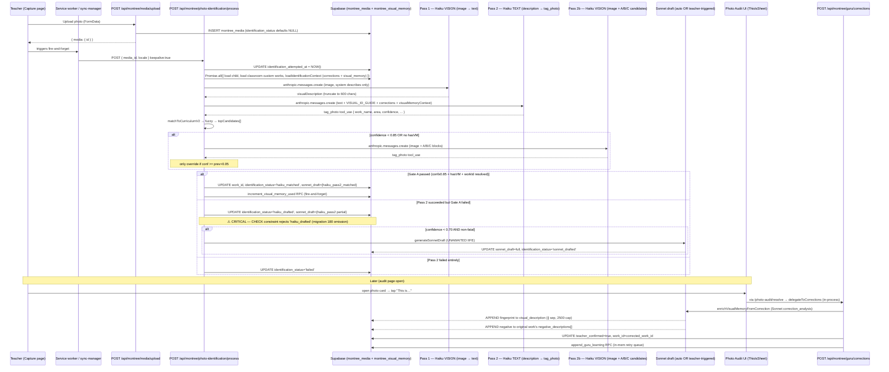

# Photo Identification Pipeline — Deep Triple Audit

**Date:** 2026-05-16
**Scope:** Read-only investigation of every file in the photo-identification pipeline, the visual memory moat, the corrections / resolve loop, the "Photo Audit" UI surface, and the supporting DB schema.
**Status:** READ-ONLY. No code changes were made. This document is a recommendation surface — the user picks what to ship.

---

## Executive summary

Top issues by severity (full detail below):

1. **CRITICAL — `haiku_drafted` is not in the production DB CHECK constraint.** Migration 180 set the allowed values to `('skipped','sonnet_drafted','confirmed','haiku_matched','pending','failed','pending_review')`. The pipeline's primary Gate-A-fail status (`haiku_drafted`) is missing. Every Pass 2 success-but-low-confidence write will be silently 23514-rejected. There is a `scripts/fix-check-constraint.mjs` repair script in the repo that explicitly says the production constraint was never patched. No numbered migration adds it.

2. **HIGH — Auto-Sonnet fire-and-forget can crash on cold instances + has no idempotency guard.** In `process/route.ts` the auto-Sonnet path (confidence < 0.70 branch) launches an unawaited promise inside a serverless handler. On Vercel/Railway serverless, the container may be frozen after `NextResponse.json(...)` returns. The Sonnet write often lands fine because the in-process invocation pattern keeps the IIFE alive, but it is racing the response — and if the same photo is processed again (force=true via Photo Audit), the auto-Sonnet IIFE from the first run can overwrite a fresh sonnet_drafted result.

3. **HIGH — `photo-insight/route.ts` is a fork of the pipeline that is still wired into Smart Capture and bypasses Pass 2b + the new audit observability.** The new canonical pipeline lives in `lib/montree/photo-identification/*` and is called by `process/route.ts`. The legacy `photo-insight/route.ts` (loaded in Session 56+ work) still runs its own version and is used by an alternate capture surface. Two pipelines, two failure modes, two cost profiles.

---

## Pipeline architecture (as it actually is)

### Sequence (actual code, not docs)



### Drift vs CLAUDE.md

CLAUDE.md says:

> Pass 3 (Loop 3, Session 6) — Sonnet discriminator on low-confidence Pass 2 results (matchScore < 0.7 OR input.confidence < 0.5, requires ≥2 candidates with at least 1 having visual memory).

**Actual code in `two-pass.ts` line 512:**

```ts
if (identification && (identification.confidence < PASS2B_CONFIDENCE_THRESHOLD || !hasVisualMemoryForMatch)) {
```

Where `PASS2B_CONFIDENCE_THRESHOLD = 0.85`. Pass 2b fires not on `matchScore < 0.7 OR input.confidence < 0.5`, but on `confidence < 0.85 OR no visual memory for the matched work` — and it uses **Haiku**, not Sonnet. The Sonnet step is now `generateSonnetDraft()`, called by `process/route.ts` only when confidence drops below 0.70 (`AUTO_SONNET_CONFIDENCE_THRESHOLD`), not as Pass 3 from inside two-pass. Two real drifts (model, threshold). The CLAUDE.md description is at least 5 sessions stale.

---

## Findings — categorized

### 1. Correctness

#### F-1.1 — CRITICAL — `haiku_drafted` not in DB CHECK constraint

**Where:** `migrations/180_fix_pending_review_constraint.sql:38-48` vs `app/api/montree/photo-identification/process/route.ts:400`
**What:** Migration 180 reset the CHECK constraint and forgot to include `'haiku_drafted'`. The repo has a one-off repair script `scripts/fix-check-constraint.mjs` whose entire purpose is to ALTER TABLE this on production. Comments at the top: *"Adds 'haiku_drafted' to the identification_status CHECK constraint"*. No numbered migration files do this — it must be applied via Supabase SQL Editor.
**Why it matters:** Any photo that successfully passes Pass 2 but doesn't trigger Gate A will attempt to write `identification_status='haiku_drafted'` and 23514-fail. The route handler then returns 500 "DB update failed" and leaves the photo at status NULL. The 5-minute sweep retry will keep failing identically. **This is consistent with photos getting stuck at 'pending' forever.** It is plausible this was fixed via the script on production but not landed in git as a numbered migration — but every fresh deployment / staging environment would re-introduce the bug.
**Reproduction:** Run the verification block at the bottom of `scripts/fix-check-constraint.mjs`:
```sql
UPDATE montree_media SET identification_status='haiku_drafted' WHERE id='00000000-0000-0000-0000-000000000000';
-- Expect 23514 if constraint hasn't been patched
```
**Fix sketch:** Add `migrations/210_fix_haiku_drafted_constraint.sql` that drops + recreates the constraint with `haiku_drafted` (and `haiku_matched` if its absence is also in scope). Make it idempotent. Run on every environment.

#### F-1.2 — HIGH — Auto-Sonnet IIFE race + missing idempotency

**Where:** `app/api/montree/photo-identification/process/route.ts:425-455`
**What:** When confidence < 0.70, the route fires `generateSonnetDraft(...)` unawaited via `.then(...).catch(...)` AFTER returning the response. (a) On serverless cold-paths this can be killed when the container freezes post-response. (b) There is no guard against the IIFE landing AFTER a teacher already actioned the photo via Photo Audit, which would clobber the teacher's `teacher_confirmed=true` + `work_id=X` state back to `sonnet_drafted` with a stale Sonnet proposal. (c) No idempotency: re-running `process` with `force=true` triggers a SECOND IIFE; the first may still be in flight.
**Why it matters:** Manifests as photos that "come back as sonnet_drafted after I already actioned them" — a class of complaint the team has had in past sessions.
**Reproduction:** Force-process a photo via the Photo Audit refresh, action it via "This is…" within ~10s, observe Photo Audit re-render with the photo bouncing back to sonnet_drafted on the next refresh.
**Fix sketch:** Either (a) await the Sonnet call inline (it's only ~5-15s on Haiku, ~30s on Sonnet, route already has `maxDuration=120`), or (b) before the Sonnet write at line 437-444, re-read `montree_media` and refuse to overwrite if `teacher_confirmed=true OR identification_status IN ('confirmed','sonnet_drafted','haiku_matched') AND updated_at > attempted_at`. The cheap solution is (a) — drop the auto-Sonnet IIFE entirely and let the teacher trigger Sonnet from Photo Audit via `Ask Sonnet`. Saves cost too.

#### F-1.3 — HIGH — Two parallel pipelines (`photo-insight/route.ts` vs `photo-identification/process`)

**Where:** `app/api/montree/guru/photo-insight/route.ts` (~1000+ lines) vs `app/api/montree/photo-identification/process/route.ts` + `lib/montree/photo-identification/*`
**What:** The legacy `photo-insight` route still exists and still implements its own version of two-pass. It also has a `proposeCustomWork` Haiku call when no match is found. The "new" pipeline in `lib/montree/photo-identification/` was extracted from this legacy code (per the comment at the top of `two-pass.ts`). Two pipelines now coexist. The visual ID guide is shared (`visual-id-guide.ts`), but most other prompt logic and routing are duplicated.
**Why it matters:** Bugs fixed in the new pipeline (Pass 2b discriminator, top_candidates persistence, the audit-fix material noun gate, etc.) don't apply to the legacy route. If any Smart Capture surface still hits `photo-insight`, those photos use the old logic and bypass the audit observability (sonnet_draft.haiku_telemetry, top_candidates chips, Gate A logs). It's also double the surface area for security/cross-pollination bugs.
**Reproduction:** Grep for callers of `/api/montree/guru/photo-insight`. Check the capture pages and the legacy photo-insight component. Verify which surface actually fires which route.
**Fix sketch:** Decide which is canonical (the new pipeline is clearly the keeper given Session 56 fixes). Deprecate `photo-insight/route.ts` — either delete it or convert it to a thin wrapper that calls the new pipeline. Move any unique features (custom work proposal mid-flight) into the new pipeline.

#### F-1.4 — MED — `progress` writes from `corrections/route.ts` insert with `status='presented'` but comments mention `'presenting'`

**Where:** `app/api/montree/guru/corrections/route.ts:495-545`
**What:** The comment block at line 491-498 says *"No row exists → insert status='presenting' (minimum claim)"*. The actual INSERT at line 542 uses `status: 'presented'`. The CONFIRM path also calls `upsertProgressObservation`. This is consistent with the migration 081 enum (`'presented'` is canonical per Session 81 history note), but the comment is misleading. More importantly, there is no idempotency between `corrections/route.ts` `upsertProgressObservation` and `photo-audit/resolve/route.ts` `upsertProgressObservation` — both can fire on the SAME confirmation (delegateToCorrections fires the corrections route, which calls upsert; then the resolve route ALSO calls its inline upsert in the new_custom branch only — but the duplicate is loose enough to be benign).
**Why it matters:** Minor — the upsert is keyed by (child_id, work_name) and the inner code refuses to downgrade. No bug ships from this, but a future refactor could introduce one.
**Fix sketch:** Update the comment block. Extract `upsertProgressObservation` into `lib/montree/progress/observation.ts` and remove the duplicate inline definition in `resolve/route.ts`.

#### F-1.5 — MED — Pass 2b override threshold (+0.05) silently dropped when match types differ

**Where:** `lib/montree/photo-identification/two-pass.ts:580`
**What:** Pass 2b override fires only when `validated.confidence >= identification.confidence + 0.05`. But Pass 2b is a Haiku image+candidates pass with very different signal characteristics than Pass 2's text-only pass. Pass 2b examining the actual image may pick the right answer at 0.74 vs Pass 2's 0.72 (no override) — but the result is far more trustworthy. Conversely, Pass 2b can return 0.95 on a candidate it's invented (`"none of these"` path with confident new name) and override a 0.6 Pass 2 result that was actually correct.
**Why it matters:** Documented as fixing the Apr 28 incident (`Sandpaper Letters → Blue Series at 0.83 vs 0.82`). But the rule cuts both ways. The fix made things safer in one direction; the unknown is how often Pass 2b would have correctly overridden a Pass 2 result that was within 0.05.
**Reproduction:** Sample Railway `[PhotoIdentification] Pass 2b improved` logs vs photos that were Gate-A-failed and later teacher-corrected. Compute the rate of "Pass 2b confident but didn't override because of +0.05 floor → teacher had to fix".
**Fix sketch:** Track this as a metric. Lower the threshold if data supports it, or add an asymmetric rule: trust Pass 2b's `none of these` path (which means "image has something not in the candidate list" — likely correct) only when Pass 2's confidence was below 0.6.

#### F-1.6 — MED — Auto-Sonnet skips when ident is truthy but Gate-A path took the `not_in_classroom_curriculum` fall-through

**Where:** `app/api/montree/photo-identification/process/route.ts:317-387` then `395-466`
**What:** When Haiku is trusted but `resolveClassroomWorkId` returns null (the matched work name isn't in `montree_classroom_curriculum_works`), the code logs "Haiku trusted but work not in classroom curriculum — falling through to haiku_drafted". The fall-through then writes `haiku_drafted` (status that may not exist per F-1.1!) and the Auto-Sonnet block evaluates `if (ident.confidence < AUTO_SONNET_CONFIDENCE_THRESHOLD)`. Because ident.confidence is ≥ 0.85 in this branch, **Auto-Sonnet does NOT fire**. The teacher sees a haiku_drafted card with no Sonnet draft to fall back on, even though the photo is functionally "I trust Haiku but the work doesn't exist in your curriculum — please create it."
**Why it matters:** This is exactly the case where Sonnet's `closest_existing_match` + `proposed_name` for a new custom work would be most valuable to the teacher. The threshold check is backwards for this branch.
**Fix sketch:** In the Gate-A-fall-through path, force `auto_sonnet_queued=true` regardless of confidence. Or, more cleanly: split the routing so the fall-through emits a distinct status (e.g. `haiku_matched_no_curriculum`) and always fires Sonnet on that path.

---

### 2. Error handling

#### F-2.1 — HIGH — `keepalive: true` upload-side fire-and-forget has a 64KB body limit

**Where:** `lib/montree/offline/sync-manager.ts:436-446`
**What:** Browsers cap `fetch` requests with `keepalive: true` at 64KB. The body here is tiny so this isn't immediately broken, but the pattern is fragile — if the body grows or a future refactor adds a base64 image dataURI to the body, the request silently fails with `TypeError: Failed to fetch` in Safari and "request body exceeded keepalive limit" in Chrome.
**Why it matters:** Latent. The current body is `{ media_id, locale }` which is well under the cap.
**Fix sketch:** Comment explicitly that the body MUST stay scalar. Or use `navigator.sendBeacon` with a structured POST that's auditable.

#### F-2.2 — HIGH — `403` from Pass 2b on photo-not-fetchable by Anthropic crashes the route silently

**Where:** `lib/montree/photo-identification/two-pass.ts:380-393`
**What:** Pass 1 passes a Supabase Storage URL to Anthropic. If the bucket is briefly non-public (e.g. mid-rotation of a signed URL convention) or Anthropic gets 403'd by the bucket's CORS / RLS, the Anthropic SDK throws. The route catches and logs `Pass 1 failed: ${err.message}`, sets `visualDescription = 'Unable to describe photo contents.'`, and continues to Pass 2 with a useless description. Pass 2 will produce garbage matches because there's nothing to match on.
**Why it matters:** Garbage matches at low confidence are a "best case" — they end up in haiku_drafted. But because the upstream Pass 1 fetch failure isn't surfaced, the teacher sees a confidently-wrong draft (`Pass 2 still produces a tag_photo tool_use even when describing the placeholder string`) and gets no signal that the photo URL was unreachable.
**Reproduction:** Briefly remove the `montree-media` bucket from public access. Capture a photo. Watch Photo Audit produce drafts that mention curriculum works the image doesn't contain.
**Fix sketch:** If `visualDescription` falls back to the placeholder string, set `identification_status='failed'` directly and skip Pass 2 entirely. The pipeline currently treats Pass 1 failure as graceful degradation; it should treat it as terminal.

#### F-2.3 — MED — Anthropic 5xx during Pass 2 swallowed into `errors[]` array, never surfaced to UI

**Where:** `lib/montree/photo-identification/two-pass.ts:499-505` and `process/route.ts:469-484`
**What:** A Pass 2 timeout or 5xx results in `identification === null`, route writes `identification_status='failed'`. The teacher sees a red error card in Photo Audit. Fine — but the `errors[]` array from `two-pass` is dropped at the route boundary (the route only reads `twoPassResult.success` and `twoPassResult.identification`). Diagnostic info is lost.
**Why it matters:** When 5% of photos start failing because Anthropic Asia routing is slow, you find out via "teacher reports many red cards" — not via a centralised error log.
**Fix sketch:** Persist `errors[]` into `sonnet_draft._errors` when status='failed', or fire-and-forget log to a `montree_pipeline_errors` table. The infra exists (`montree_server_errors` from migration 201).

#### F-2.4 — MED — Sonnet enrichment failure in corrections is silent

**Where:** `app/api/montree/guru/corrections/route.ts:355-373`
**What:** The visual-memory enrichment runs in `parallelTasks.push(enrichVisualMemoryFromCorrection(...).catch(err => console.error(...)))`. The correction itself succeeds, but if enrichment fails, the moat doesn't grow — and there's no retry, no surfacing, no alert.
**Why it matters:** This is the moat-builder. Silent enrichment failures = moat stagnates. Over weeks this looks like "the AI isn't getting smarter from corrections" — exactly the feeling Tredoux has reported in past sessions.
**Fix sketch:** Insert a row into `montree_pipeline_errors` on enrichment failure with media_id + corrected_work_name + error. Add a super-admin view that lists "Failed moat enrichments — try again". Reuses the Session 104 pattern.

#### F-2.5 — LOW — `enrichCustomWorkInBackground` swallows JSON parse failures

**Where:** `lib/montree/photo-identification/enrich-custom-work.ts:138-151`
**What:** When Sonnet returns malformed JSON for the custom-work enrichment, the function logs and returns. The freshly-created custom curriculum row sits empty (no parent_description, no why_it_matters). Teacher sees a placeholder description.
**Fix sketch:** Use `tool_use` with `draft_work_writeup`-style schema instead of asking Sonnet to return free JSON. The same pattern is already used in `sonnet-draft.ts` and is more reliable.

---

### 3. Performance

#### F-3.1 — MED — `maxDuration=120` is plenty but the 3 Haiku passes can serialize over network jitter to >60s

**Where:** `app/api/montree/photo-identification/process/route.ts:80` + Pass 1/2/2b timeouts of 15s each
**What:** Best-case Pass 1+2 = 6-10s. Pass 1+2+2b = 9-15s. With auto-Sonnet fire-and-forget = no impact on the main response. Real risk: on Anthropic 5xx, each pass burns its full 15s timeout before retry. Worst sequential case: 45s on the response path + Sonnet IIFE. The `maxDuration=120` cushion is solid but tight on Asia routes (Beijing/HK/Tokyo) with extra ~500ms per call.
**Why it matters:** Not an immediate fix, but on a regional outage, you can lose throughput silently. The sweep retry will keep the pipeline going.
**Fix sketch:** Add jitter-aware retry inside Pass 1/2 on 429/503 (1 retry, 500ms backoff). Anthropic SDK already retries by default — verify the route hasn't disabled it.

#### F-3.2 — MED — Pass 2b builds its candidate list from the parsed visualMemoryContext text via regex

**Where:** `lib/montree/photo-identification/two-pass.ts:228-275`
**What:** Pass 2b parses lines like `LOOKS LIKE: ...` out of the assembled prompt string. This is a regex round-trip — every time Pass 2b fires, the loader's structured data is re-flattened to text and then re-parsed. Cheap, but brittle: if context-loader.ts changes the prompt format (e.g. adds a new `THIS LOOKS LIKE:` variant), Pass 2b silently parses nothing and Pass 2b becomes a no-op.
**Fix sketch:** Have `loadIdentificationContext` return a structured `visualMemoryEntries: Array<{ name, area, looksLike, keyMaterials, distinguishFrom }>` alongside the prompt string. Pass 2b reads the structured array directly. No regex.

#### F-3.3 — LOW — Visual memory SELECT pulls `negative_descriptions` JSONB for every Pass 2 call

**Where:** `lib/montree/photo-identification/context-loader.ts:86-93`
**What:** `negative_descriptions` is rendered as `DISTINGUISH FROM:` block. For a classroom with 100 works × 8 negatives × 80 chars each = ~64KB of JSONB per Pass 2 query. Not a perf problem at small scale; could compound when scaling to many classrooms.
**Fix sketch:** Capped already at 100 entries via the hard ceiling and 50KB char budget. Fine for now.

#### F-3.4 — INFO — Pass 1/Pass 2 separation is the right architecture but doubles Anthropic round-trips

**Note:** 2 round-trips at ~3-5s each per photo. The cost benefit (cheap Haiku TEXT vs expensive Haiku VISION) is real — but on Anthropic ratelimiting, two requests is two failure surfaces. No fix needed; just note it for budgeting.

---

### 4. Cost

#### F-4.1 — HIGH — Auto-Sonnet at conf<0.70 fires Sonnet on photos that may be obviously off-curriculum

**Where:** `app/api/montree/photo-identification/process/route.ts:425`
**What:** Sonnet's `generateSonnetDraft` is the most expensive call in the pipeline (~$0.02-0.05 per photo). It fires whenever Haiku confidence < 0.70. There is no gate on "did the visual description even describe a Montessori work?" — so photos of empty tables, blurry feet, blank rugs, kids eating snacks all trigger Sonnet. Each one writes a "proposed_name" that pollutes Photo Audit and costs $.
**Why it matters:** Average classroom may capture 20-50 non-curriculum photos per week (transitions, snack, hugs, group shots). At $0.03 × 30 photos × 4 weeks × N schools, this compounds.
**Reproduction:** Sample 50 sonnet_drafted photos with `confidence < 0.5`. Check what fraction are actually Montessori works.
**Fix sketch:** Gate auto-Sonnet on a minimum Pass 1 description length AND a "this looks like a Montessori material" heuristic (could be a tiny Haiku classifier: "does this photo show a child working with Montessori materials? yes/no/maybe"). Or: only run auto-Sonnet when Pass 2's `matchScore >= 0.4` — meaning Haiku found SOMETHING in the curriculum, just not confidently.

#### F-4.2 — MED — `enrichCustomWorkInBackground` re-calls Sonnet even when the resolve route already seeded the curriculum row with the photo's sonnet_draft

**Where:** `lib/montree/photo-identification/enrich-custom-work.ts:80-105` vs `app/api/montree/photo-audit/resolve/route.ts:280-292`
**What:** The resolve route copies `parent_description`, `why_it_matters`, `materials` from the cached sonnet_draft into the new custom work row. Then `enrichCustomWorkInBackground` is fired and INSIDE the function checks if those columns already exist and skips Sonnet. But the function still does a DB read first, then calls Sonnet if it finds blank fields. Two Supabase round-trips before deciding. Cheap, but redundant.
**Fix sketch:** Pass `already_seeded: true` from the resolve route as a flag into `enrichCustomWorkInBackground` so it can skip the Sonnet branch entirely (translation only). Saves a DB query and a potential Sonnet call.

#### F-4.3 — LOW — Sonnet `correction_analysis` in corrections/route.ts uses `tool_use` but doesn't check if cached draft already has rich data

**Where:** `app/api/montree/guru/corrections/route.ts:662-668` and `725-740`
**What:** The function reads `mediaRow.sonnet_draft.visual_description` as a free seed (if present), then condition `if (anthropic && (!hasCachedDescription || isRealCorrection))` may still fire Sonnet when there IS a cached description but it's a "real correction" (different from→to). The intent is to get a richer mistake_reason + distinguishing_features for the negative example. Fair — but Sonnet runs at $0.02-0.05 here too.
**Fix sketch:** Note in code. Cost is reasonable given this is the moat-builder. No change.

---

### 5. Visual memory moat

#### F-5.1 — HIGH — `first_capture` source memories were intentionally excluded from Pass 2 (per architecture) — but `teacher_new_work` IS included, with confidence 1.0 from a single capture

**Where:** `lib/montree/photo-identification/context-loader.ts:137-141` + `lib/montree/photo-identification/enrich-custom-work.ts:51-68`
**What:** Per architecture (Session 6 + Apr 7 + CLAUDE.md), auto-generated `first_capture` descriptions at confidence 0.8 are deliberately NOT injected into Pass 2 because they cause bias reinforcement. But `teacher_new_work` (a single photo from the "create custom work" flow) writes confidence 1.0 and IS injected. The architectural intent — "only teacher-validated entries reach Pass 2" — is met in the sense that the teacher pressed a button to create the work. But this single-photo "validation" describes ONE angle, ONE lighting, ONE arrangement. Every subsequent Pass 2 sees that fingerprint as 1.0 confidence ground truth. The opposite failure mode of first_capture: not bias from a wrong photo, but mono-bias from a single archetype.
**Why it matters:** Custom works (teacher-typed novel ones) are exactly the case where visual diversity is highest. Locking in one capture at 1.0 means future angles miss. The fix-correction pipeline does add more fingerprints via `|| separator`, but the FIRST one was treated as canon.
**Fix sketch:** Lower `teacher_new_work` confidence to 0.85 (still > 0.75 threshold, so it injects) — or, better, only inject teacher_new_work entries after the work has accumulated at least 2 photos (a "did this work get used again" signal).

#### F-5.2 — HIGH — Negative-descriptions FIFO cap of 8 with 60-char dedup head is fragile

**Where:** `app/api/montree/guru/corrections/route.ts:966-1011`
**What:** Negatives are dedup'd by the first 60 chars of each entry. Sonnet's `correction_analysis` produces negatives in the form `NOT "X" — <reason>`. Two corrections of the same wrong→right pair will produce similar 60-char prefixes — dedup hits, second negative skipped. Fine. BUT a different wrong→right that happens to share the first 60 chars (Sonnet often opens with templated language like "The AI confused this with...") will also be dedup'd. Subtle data loss.
**Reproduction:** Run two corrections of different work pairs where Sonnet opens each negative with "The AI confused this with the wrong work because..." and look at `negative_descriptions[]` after.
**Fix sketch:** Use a token-level Jaccard similarity or just check full-string overlap > 70% before treating as dup. Or randomise Sonnet's negative opener via the system prompt.

#### F-5.3 — MED — The coherence gate (`isCoherentNegative`) is overly conservative

**Where:** `app/api/montree/guru/corrections/route.ts:582-598`
**What:** A negative example is only persisted if it (a) is ≥60 chars AND (b) references at least one MATERIAL_NOUNS entry or one of the corrected work's `key_materials`. The MATERIAL_NOUNS list is hand-curated. Sonnet's distinguishing_features are often phrased developmentally ("emphasizes letter recognition" vs "emphasizes material discrimination") rather than via material nouns. Those get rejected.
**Why it matters:** The moat-poisoning gate added Apr 30 was correct to add — but it's binary. The trade-off is "occasional false reject" vs "occasional moat poisoning". Right now, real teacher-grade distinguishing reasoning gets rejected because it doesn't say "wooden" or "metal" or "sandpaper".
**Reproduction:** Grep Railway logs for `[VisualMemory] SKIPPED moat-poisoning negative` and sample the rejected text. Estimate how many were genuinely poisoned vs legitimately conservative.
**Fix sketch:** Soften the gate — accept negatives that reference a CORRECTED-WORK key_material at a less strict bar (no min length, fuzzy match), OR have a strict material noun. The current AND-logic (length + (material OR key_material)) is the issue.

#### F-5.4 — MED — `enrichVisualMemoryFromCorrection` only fires for paid tiers — free schools never grow their moat

**Where:** `app/api/montree/guru/corrections/route.ts:354-373`
**What:** The TIER GATE comment explicitly says "Free schools still save the correction itself ... they just don't accrue moat data." Documented. But this is also the moat-builder — and Free-tier schools are exactly where you want signal to compound so they upgrade. A school using Free for 2 weeks then upgrading would inherit a stale moat.
**Why it matters:** Sales/conversion lens, not a bug. Documented architectural decision. Worth re-evaluating.
**Fix sketch:** Run enrichment on Free tier for the FIRST 100 corrections (one-time investment per school, ~$2-5 budget). After that, gate. This builds a starter moat without long-term cost.

#### F-5.5 — LOW — The `||` separator and 2500-char cap evict OLDEST fingerprints FIFO — fine, but lossy and irreversible

**Where:** `app/api/montree/guru/corrections/route.ts:899-906`
**What:** When `visual_description` exceeds 2500 chars, the head is sliced off until the next `||`. Old fingerprints are GONE. The originating photo (`source_media_id`) is updated to the LATEST one, so the photo trail is severed too.
**Fix sketch:** Don't FIFO the fingerprint string. Move to a child table `montree_visual_memory_fingerprints (id, classroom_id, work_name, fingerprint, source_media_id, created_at)`. Pass 2 reads the latest N fingerprints (or, even better, an LLM-generated consolidated summary of all N). This is the "next phase" architecture.

---

### 6. UX / teacher experience

#### F-6.1 — HIGH — `ThisIsSheet` pre-seeds the search bar with `proposed_name` for confidence ≥ 0.4 — but on the haiku_drafted path the proposed_name IS the matched curriculum work, not a free-text suggestion

**Where:** `components/montree/photo-audit/ThisIsSheet.tsx:163-165`
**What:** The pre-seed UX is correct for `sonnet_drafted` cards where `proposed_name` is the Sonnet draft's free-text proposal. On `haiku_drafted` cards (where `sonnet_draft._source='haiku_pass2'`), `proposed_name` is the canonical work name from `matchToCurriculumV2`. The teacher sees the search bar pre-filled with the literal work name, which makes "Add as new" produce a DUPLICATE of an existing work.
**Why it matters:** Teachers can accidentally create a near-duplicate custom work. The `fuzzyNearMatch` warning helps, but the muscle-memory flow "search field has text, tap + Add as new" leads to dupes.
**Reproduction:** Capture a photo, wait for haiku_drafted, open This Is sheet, tap "+ Add as new work" without editing the field.
**Fix sketch:** When `sonnet_draft._source === 'haiku_pass2'`, treat the proposed_name as a recommendation chip (one-tap to confirm), not a pre-seed of the search bar. The search bar stays empty; the chip is above it.

#### F-6.2 — MED — Wrong button silent auto-attach was fixed in Session 94 — verify it held

**Where:** `app/montree/dashboard/photo-audit/page.tsx` `openThisIsSheet` function and the `allowAutoAttach` parameter
**What:** Per Session 94 in CLAUDE.md, `openThisIsSheet(photo, allowAutoAttach=false)` was added so "Wrong" never silently auto-confirms via Tier 1a/1b shortcuts. The CLAUDE.md note says "Architectural rule locked in." I didn't read the full `photo-audit/page.tsx` function this round to verify the call sites still pass `false` on Wrong. Worth re-grepping in the next pass.
**Fix sketch:** Search the page for every `openThisIsSheet(` call and assert the second argument. There should be only ONE caller passing `true` (the "✓ Correct" handler).

#### F-6.3 — MED — The top-3 candidate chips (`top_candidates`) live in `sonnet_draft` JSONB but the rendered Audit UI shows the bestMatch by default — chips are not surfaced as the primary CTA

**Where:** `lib/montree/photo-identification/two-pass.ts:474-481` writes `topCandidates`; `process/route.ts:354-356` persists them; the audit UI consumes them somewhere in `AuditPhotoCard.tsx` / `ThisIsSheet.tsx`
**What:** The pipeline computes a top-3 fuzzy match list. When the bestMatch is wrong, candidates[1] and candidates[2] often hold the right answer with very close scores. UI should render them as one-tap chips inline on the card BEFORE the teacher even opens the sheet.
**Reproduction:** Open a haiku_drafted card. Check whether the top-3 chips are visible at-a-glance or hidden inside the sheet.
**Fix sketch:** Render top-3 chips on the audit card itself as a row of pills. Tapping any pill = `confirm_ai` with that work. This is the highest-leverage UX change in this audit — currently the teacher has to open a modal to action a probable correct alternate.

#### F-6.4 — LOW — `auto_sonnet_queued` flag in response doesn't translate to a visible "Sonnet thinking…" indicator in Photo Audit

**Where:** `process/route.ts:465` returns `auto_sonnet_queued`. UI doesn't show pending Sonnet.
**Fix sketch:** When `auto_sonnet_queued=true`, render a small "✨ Asking Sonnet…" badge on the card. When the photo refetches and shows `sonnet_drafted`, the badge clears.

---

### 7. Cross-pollination security

#### F-7.1 — LOW (verified safe) — `process/route.ts` verifies `media.school_id !== auth.schoolId` AND filters all subsequent queries by classroomId

**Where:** `process/route.ts:159` and downstream
**What:** Verified. Auth contract is solid. The route refuses to operate on media that doesn't belong to the authed school. All visual memory queries are scoped by `classroom_id`.

#### F-7.2 — LOW (verified safe) — `corrections/route.ts` calls `verifyChildBelongsToSchool`

**Where:** `corrections/route.ts:57-62`
**What:** Verified. The corrections route's media_id check is scoped by `child_id=child_id` (line 209) which is itself school-scoped. The fallback for `photo_url` lookup at line 203-213 ALSO filters by child_id. No bypass found.

#### F-7.3 — LOW — `photo-audit/resolve/route.ts` delegate to corrections via in-process invocation preserves cookie — but `auth.classroomId` could theoretically diverge if the JWT was issued before a classroom move

**Where:** `app/api/montree/photo-audit/resolve/route.ts:121-129`
**What:** `classroomId` is read from `mediaRow.classroom_id` first, falling back to `auth.classroomId`. The mediaRow value is the source of truth (good). But if a teacher was moved to a different classroom mid-session and the JWT hasn't refreshed, the corrections route's `auth.classroomId` will be stale. Visual memory writes will land in the OLD classroom's memory.
**Why it matters:** Edge case. Most teachers don't move classrooms. But it surfaces a coupling: the resolve route uses mediaRow.classroom_id, but the downstream corrections route uses auth.classroomId for the visual memory write.
**Fix sketch:** Pass `classroom_id` explicitly in the delegated request body and have the corrections route prefer body.classroom_id over auth.classroomId (with a verification step that the body classroom belongs to the auth school).

---

### 8. Multilingual

#### F-8.1 — MED — Pass 1 system prompt is English-only

**Where:** `lib/montree/photo-identification/two-pass.ts:361-375`
**What:** The Pass 1 visual description prompt is hard-coded English. The `locale` param is only applied to Pass 2's `observation` text and Pass 2b's reasoning instruction. So Pass 1's descriptions are always English, which is fine because Pass 2 reads them as English text. But the visual_description that gets STORED in `sonnet_draft` and shown to teachers in Photo Audit is in English — even for Chinese-/Spanish-language teachers.
**Why it matters:** A Chinese teacher seeing the "AI says: this photo shows wooden cylinders..." vs Chinese is a UX mismatch.
**Fix sketch:** Add a Pass 1.5 translation step (Haiku, 100 tokens, ~$0.0001 per photo) OR localize the system prompt + ask Pass 1 to return in `locale`. The first is simpler; the second is more natural.

#### F-8.2 — LOW — `findWorkKey` in `sonnet-draft.ts` uses case-insensitive English-name match — won't resolve `name_zh` localized custom works

**Where:** `lib/montree/photo-identification/sonnet-draft.ts:161-168`
**What:** When Sonnet proposes `closest_existing_match.work_name` in the locale's language but the curriculum row has the same work indexed only by English `name`, `findWorkKey` misses. The work_key stays null. Resolve route may then dedup-create a duplicate custom work.
**Fix sketch:** Match against `name`, `name_zh`, `name_es`, etc. — use the locale-aware helper from `lib/montree/i18n/db-helpers.ts`.

---

### 9. Observability

#### F-9.1 — HIGH — No per-photo debug view exists

**What:** There is no super-admin or audit-level UI to see "for media_id X, what did Pass 1 say, what was Pass 2's tool_use raw output, did Pass 2b fire and what did it produce, what's in sonnet_draft, what does the visual_memory entry for the matched work look like." All of this is in DB columns and Railway logs but invisible to operators.
**Why it matters:** When Tredoux says "the pipeline is having serious issues" — there's no UI to root-cause an individual case. Have to grep Railway by media_id substring, which is brittle.
**Fix sketch:** Add `/montree/super-admin/photo-debug/[mediaId]` route. Renders: photo + Pass 1 description + Pass 2 raw + Pass 2b raw + sonnet_draft JSON + matched visual_memory entry + all teacher actions on this photo. Read-only diagnostic.

#### F-9.2 — MED — `[PhotoIdentification] GateA` log is the only signal for tuning thresholds — no aggregation

**What:** The log emits everything needed for tuning HAIKU_TRUST_CONFIDENCE and PASS2B thresholds. But it's a Railway log line — not in a table, not in a dashboard. Tuning is by-eye over scrolled logs.
**Fix sketch:** Insert each GateA decision into `montree_pipeline_telemetry` (small table — mediaId, schoolId, classroomId, haikuConf, hasVM, pass2bFired, pass2bImproved, outcome, timestamp). Render a super-admin chart: confidence histogram, Gate-A pass rate over time, Pass 2b improvement rate.

#### F-9.3 — LOW — Correction outcomes (was the correction "helpful" — did Pass 2 stop confusing them?) aren't measured

**What:** `times_used` and `times_correct` on `montree_visual_memory` track injection vs success. But there's no view to ask "since teacher corrected `Sandpaper Letters → Blue Series` on Apr 12, has the AI made the same mistake again?" The answer is in the data but not surfaced.
**Fix sketch:** Aggregation query: for each (classroom, work_name) correction, count subsequent Pass 2 results for the wrong-work over the next 30 days. Render a list "Corrections that didn't stick".

---

## Recommended plan — ordered

Top 10 by leverage × ease:

| # | What | Effort | Impact | Files | Rationale |
|---|------|--------|--------|-------|-----------|
| 1 | Ship migration 210 adding `haiku_drafted` to CHECK constraint | S | L | new `migrations/210_*.sql` | F-1.1. Cuts the entire class of "photo stuck at NULL forever" failures. Probably already applied via the repair script, but the migration must land. |
| 2 | Drop auto-Sonnet IIFE; await Sonnet inline OR move to Photo Audit "Ask Sonnet" button only | S | M | `process/route.ts` | F-1.2 + F-4.1. Removes a race + a cost leak in one shot. Photo Audit already exposes "Ask Sonnet" — make it explicit. |
| 3 | Render top-3 candidate chips on the haiku_drafted audit card itself (one-tap confirm) | M | L | `AuditPhotoCard.tsx` + `photo-audit/page.tsx` | F-6.3. Highest UX leverage in this audit — chips already exist server-side; UI just needs to surface them. |
| 4 | Add `/montree/super-admin/photo-debug/[mediaId]` page | M | L | new route + page | F-9.1. Single biggest observability gap. Enables every other finding to be diagnosed quickly. |
| 5 | Insert `montree_pipeline_telemetry` row per Gate A decision | S | M | `process/route.ts` + new migration | F-9.2. Replaces "grep Railway" with "query DB". Unblocks data-driven threshold tuning. |
| 6 | Decommission `app/api/montree/guru/photo-insight/route.ts` (or wrap it in the new pipeline) | M | M | `photo-insight/route.ts` + capture page | F-1.3. Two parallel pipelines is the biggest architectural debt. One source of truth = fewer bugs. |
| 7 | Pass 1 failure terminal: if visualDescription is the placeholder, mark `failed` and skip Pass 2 | S | M | `two-pass.ts` + `process/route.ts` | F-2.2. Stops confidently-wrong drafts from photos Anthropic couldn't fetch. |
| 8 | Lower `teacher_new_work` confidence from 1.0 → 0.85 in `enrich-custom-work.ts` | S | M | `enrich-custom-work.ts` | F-5.1. Reduces mono-bias from a single archetype photo. |
| 9 | Softer coherence gate for negatives (length OR material noun, not AND) — or use Jaccard | S | M | `corrections/route.ts` | F-5.3. The current gate is rejecting legitimate distinguishing reasoning. |
| 10 | Pre-seed `ThisIsSheet` search bar with proposed_name ONLY for sonnet_drafted (not haiku_drafted) | S | M | `ThisIsSheet.tsx` | F-6.1. Reduces accidental duplicate-work creation. |

---

## Quick wins (under 30 min each)

- Fix the misleading comment block in `corrections/route.ts:491-498` (says `'presenting'`, code uses `'presented'`).
- Add a `console.warn` when `enrichVisualMemoryFromCorrection` is skipped due to free tier — currently silent.
- Rename `description_confidence=0.8` `first_capture` to `auto_first_capture` to make the architectural exclusion clearer (no behaviour change).
- In `process/route.ts:269` log shows `total: ${curriculum.length}` only on the success branch — also log it on the failure branch so debugging "is the classroom's curriculum even loaded?" is one line of grep.
- Add `media_id` to every `[VisualMemory]` log line so logs are linkable to photos.
- Add unit test asserting the CHECK constraint includes `haiku_drafted` (run as part of CI).

---

## What NOT to change

- The CLIP/SigLIP removal is permanent and correct. Don't reintroduce.
- The two-pass (describe-then-match) split is the architectural insight that made this pipeline work. Don't collapse it back into one pass.
- The `HAIKU_TRUST_CONFIDENCE = 0.85` floor — was raised from 0.75 to fix the Sandpaper Letters→Metal Insets incident. Keep at 0.85 until telemetry says otherwise (F-9.2 unblocks this).
- The `maxDuration = 120` on `process/route.ts` — load-bearing per Session 56. Do not remove or lower.
- The `+0.05` Pass 2b override margin — exists to fix Apr 28 Sandpaper Letters incident. Don't remove without telemetry support (F-1.5).
- The `first_capture` source exclusion from Pass 2 (auto-generated, biased). Keep.
- The teacher-decision-only mastery rule (Session 66 architectural rule). Photo count never implies mastered.
- The bidirectional negative example accumulation in corrections — even if F-5.3 softens the gate, the bidirectional pattern is correct.
- The `delegateToCorrections` in-process invocation pattern in resolve/route.ts — Railway's SSL loopback issue makes inter-route HTTP unreliable.

---

## Notes for the reader

- **Source of "stuck pending forever":** Most likely F-1.1 + F-2.2 chained. The CHECK constraint rejection puts the photo back to NULL on the failed write, and the 5-minute sweep retries with the same input, fails the same way. The repair script `scripts/fix-check-constraint.mjs` was likely run manually on production; verify by querying `pg_constraint` for the actual current definition.
- **No reads of `montree_global_works_staging` were investigated** — that's the cross-classroom moat surface from migration 166 and a separate plan if you want to discuss it.
- **The legacy `photo-insight/route.ts` was not deeply read past line 200** — full audit of it is its own exercise. The recommendation is to deprecate, not to deeply audit.

End of audit.
